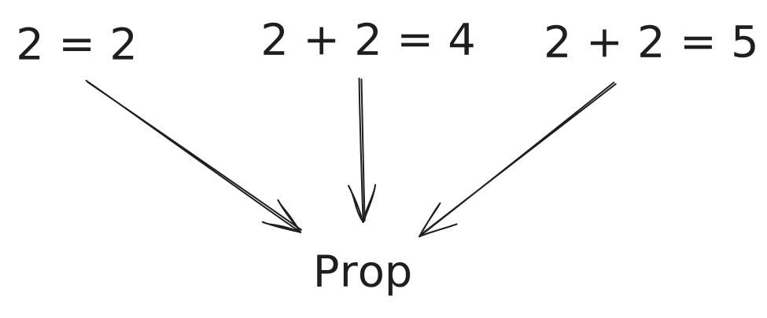
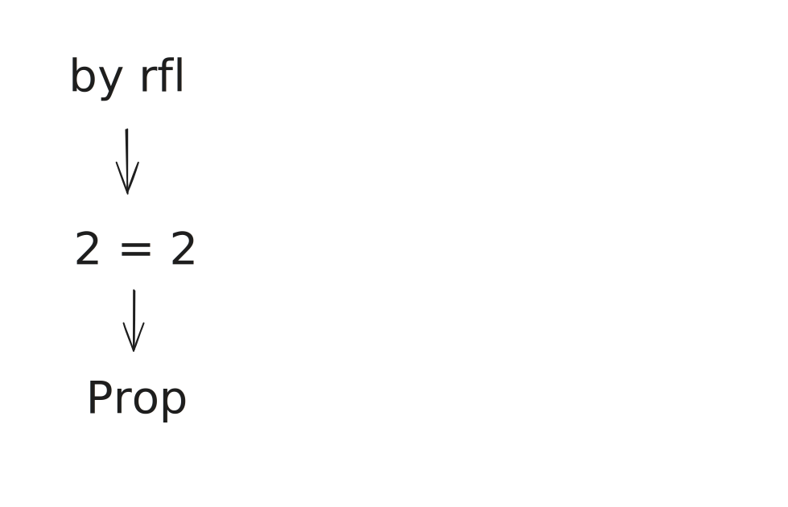
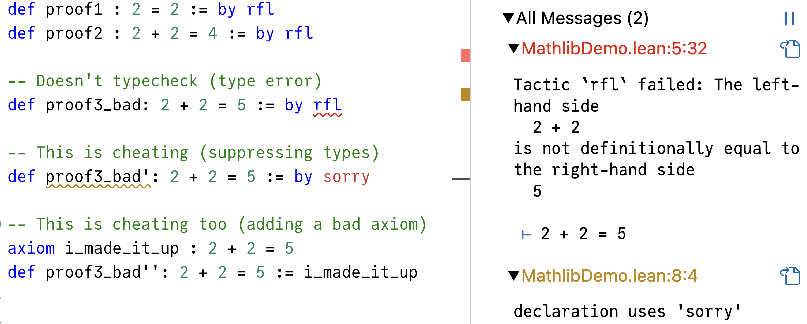
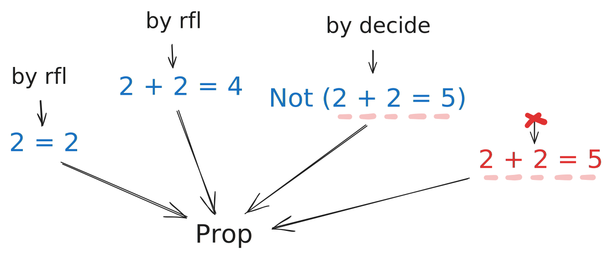
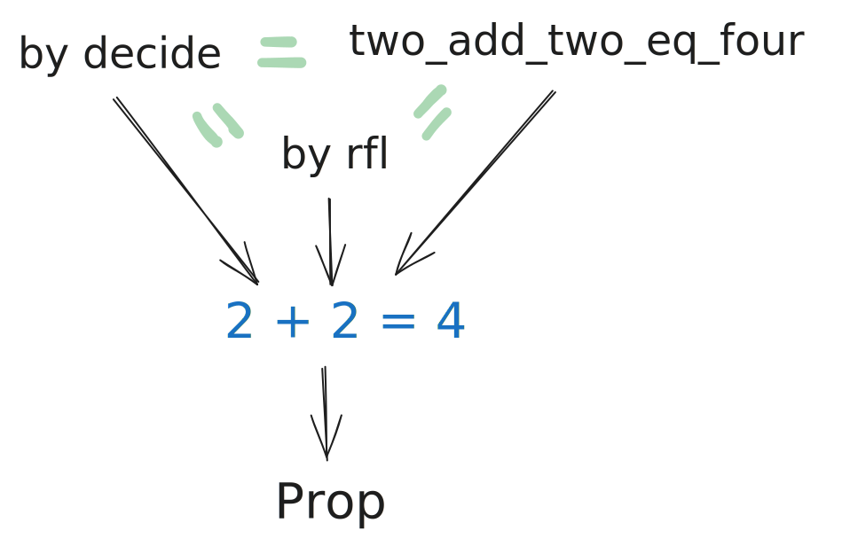
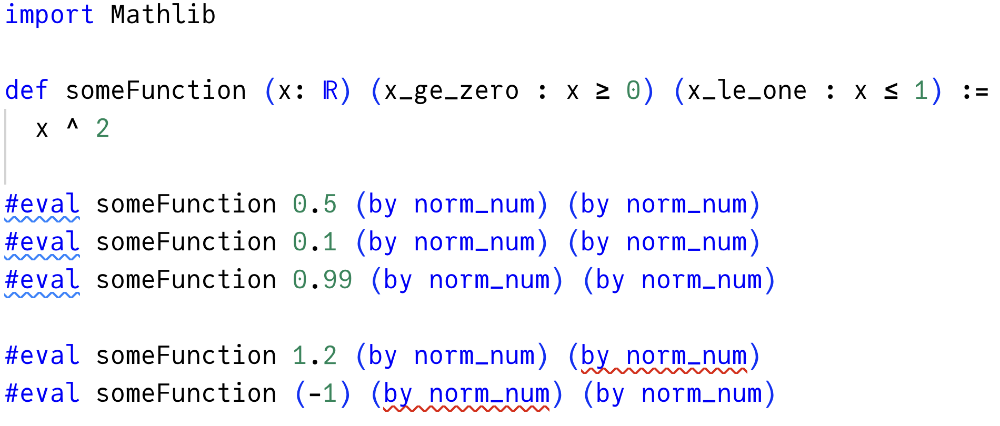
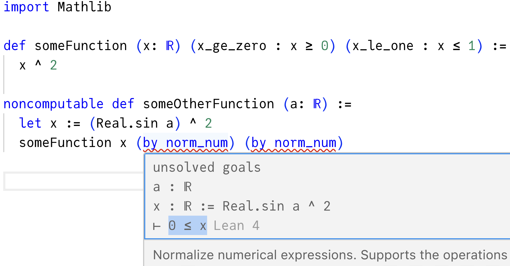
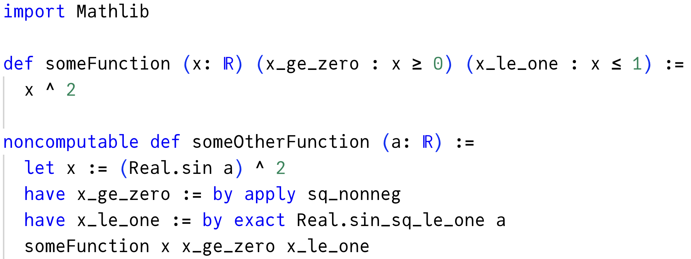

What is the type of `2 + 2 = 4`?

In TypeScript and most other languages, logical expressions have a *Boolean* type:

```js
const question1 : boolean = 2 === 2; // true
const question2 : boolean = 2 + 2 === 4; // true
const question3 : boolean = 2 + 2 === 5; // false
```

In fact, we can drop the `: boolean` type annotations because TypeScript can see that all of these are logical expressions--and so they obviously must be booleans:


Note that `question1`, `question2`, and `question3` are all of the same type. In TypeScript, there is only one `boolean` type, and only two values (`true` and `false`) of that type. Let's visualize that (an arrow means "a value is of type"):


That's how logical statements work in the vast majority of programming languages: one type, two values. However, that's not what happens in [Lean](/the-math-is-haunted/).

---

### Propositions as Values

Although Lean [can do](https://live.lean-lang.org/#codez=CYUwZgBAjgriDOAXAlgewHYQFwQEKtQBtsBeCAJggGoKIyAWAKAGIQA3AQ2NgRQ0aA) Booleans, by default it *won't* see `2 + 2 = 4` as a Boolean. Instead, `2 + 2 = 4` in Lean will give you a *Prop*--short for "logical proposition":


*(Try it in the [Lean playground](https://live.lean-lang.org/#codez=CYUwZgBAjgriDOAXAlgewHYEYIC4C8EATBAYQFCiSwIobH5EQDUjBALBeNHEmugMy5SzVhACsQA) or [VS Code](https://lean-lang.org/install/).)*

Let's annotate them explicitly so we remember that `2 + 2 = 4` is of type `Prop`:

```lean
def question1 : Prop := 2 = 2
def question2 : Prop := 2 + 2 = 4
def question3 : Prop := 2 + 2 = 5
```

Now let's visualize these values and types (an arrow means "is a value of type"):



This looks different!

When you write `2 + 2 === 4` in TypeScript, it immediately "collapses" into some `boolean` (with a possible value of `true` or `false`--in this case, it's `true`).

**But when you write `2 + 2 = 4` in Lean, it doesn't "collapse" into a verdict.** The *logical statement itself* is a distinct value. It doesn't "turn" into a `true` or a `false`. A proposition remains a proposition--a speculative claim; a logical sentence.

So how do you *know* if a proposition is true?

You compute it!

Just kidding.

**In Lean, you must *convince* the computer it's true--by presenting a proof.** Turns out, not only `2 + 2 = 4` a value, it is *also* a type. A proof is a value *of* that type.

Let's unpack this.

---

### Propositions as Types

Consider this proposition:

```lean
def claim1 : Prop := 2 = 2
```

How can you convince a computer that `2 = 2` is true? Your programmer instinct might be to just calculate both sides and compare them, but Lean is primarily used by mathematicians, and mathematics strays far outside the realm of computation. For example, if you tried to "compute both sides" to prove that `1 + 1/2 + 1/4 + 1/8 + ... = 2`, your program would require infinite time and infinite memory.

Instead, Lean forces you to think like a mathematician. To prove a claim, you need to supply a proof that builds on axioms and other proofs and connects them into a logical argument. If you've managed to construct a proof, you've proven the claim.

Let us supply a proof for this claim:

```lean {2}
def claim1 : Prop := 2 = 2
def proof1 : claim1 := by rfl
```

*([Try it in the Lean playground.](https://live.lean-lang.org/#codez=CYUwZgBAxgNghgSwLYEYIC4IAUBOB7ABwwF4IAmCUsgKFEgPzzDU1kVRIgCMBPCHMDGpA))*

For now, don't worry about what `by rfl` really means; we'll get to that a bit later. Think of it as a built-in Lean value that can prove any statement like `foo = foo`.

However, look at the types! Like in the earlier example, `2 = 2` is of type `Prop`. But here's something strange: `by rfl` itself is of type `claim1` (which is `2 = 2`).

In fact, we could replace `: claim1` with `: 2 = 2` and it would still typecheck:

```lean
def proof1 : 2 = 2 := by rfl
```

This means that our proposition `2 = 2` is not only a value, but it can also act as a type (and `by rfl` here happens to produce a value of exactly the `2 = 2` type):



You can't have such a "type tower" in TypeScript, but in Lean this is absolutely fine. The `by rfl` value has a type of `2 = 2`, and `2 = 2` has a type of `Prop`.

Now, here's what this *means.*

The fact that we were able to produce some value of the type `2 = 2` means that we have proven it. **Proving a proposition *means* producing a value of its type.** Verifying any mathematical result in Lean is nothing more than typechecking.

Since you've managed to produce a value of type `2 = 2` and `2 + 2 = 4` (either of these can be done with `by rfl`), you have effectively proven these propositions:

```lean
def proof1 : 2 = 2 := by rfl
def proof2 : 2 + 2 = 4 := by rfl
```

However, no matter how hard you try, unless there's a bug in Lean kernel, you can't produce a value of type `2 + 2 = 5` without either a [`sorry`](/the-math-is-haunted/#sorry-not-sorry) or a [bad `axiom`](/the-math-is-haunted/#the-math-is-haunted):



*([Try it in the Lean playground.](https://live.lean-lang.org/#codez=CYUwZgBADgTg9nMBGCAuCAmCBeTbcBGAnhDGADYBQoksCYW6WA1HrgCz4TGkWWUBaARAAicEAGcAdgHIALhDlEoIAMYALNQGsIACiUqIIGPBgBKauGjxEAZgD6BAIbAmEVllwBWLjzJVBYQAVdQBLCQhwiA0QJzlQqQBzPQkAVyhYSQkE5INJCxpregdnYBk3DxwIH1RCEgk4EyJ+IQgQqKiYuJzFBD0XYB6nbhcIJwAPULgAWwsJqenI+2mXEHtQuXt0tDxK70taGzASlxly3bZqrlDl1fXN9MogA))*

Let's visualize the fact that we found some proofs for `2 = 2` and `2 + 2 = 4`:


Unlike `2 = 2` and `2 + 2 = 4`, the `2 + 2 = 5` type is "lonely"--we haven't found any proof for it. Is that what it means for a proposition to be false?

A careful reader might note that we haven't actually *proven* that `2 + 2 = 5` is false. What if it's true, and we just weren't lucky enough to produce a proof of it?

In other words, what if `2 + 2 = 5` is unprovably true?

---

### Note the Not

This is an entirely valid concern!

One thing we could do is to look for a proof of the *negation* of our proposition:

```lean {3}
def proof1 : 2 = 2 := by rfl
def proof2 : 2 + 2 = 4 := by rfl
def proof3 : Not (2 + 2 = 5) := by decide
```

*([Try it in the Lean playground.](https://live.lean-lang.org/#codez=CYUwZgBADgTg9nMBGCAuCAmCBeTbcBGAnhDGADYBQoksCYW6WA1HrgCz4TGkXXjR4iAMzoAcnAAuEABQs2EAKwBKLj1ABjAJaggA))*

Note the `Not` in front of `2 + 2 = 5`. You can think of `Not (2 + 2 = 5)` as a whole separate proposition, and we've just supplied a proof for it (`by decide`):


It typechecks, therefore we know that `Not (2 + 2 = 5)` is true.

You might be wondering what `by decide` does. Previously, we've only used `by rfl`--but it can only ever produce proofs of types like `foo = foo` (e.g. `2 = 2`). The reason `by rfl` could solve `2 + 2 = 4` is because `2 + 2` and `4` unfold into `Nat.zero.succ.succ.succ.succ` on both sides by definitions of `2`, `+`, and `4`. So even `2 + 2 = 4` is actually shaped like `foo = foo`, which works for `by rfl`.

However, `by rfl` can't produce a proof of a proposition shaped like `Not (foo = bar)`. This is why we had to use the more powerful `by decide`, which generates a proof of any computable statement. It's like pulling out a calculator in the middle of a math proof. Although it is *possible* to prove `2 + 2` is not `5` step-by-step with "mindless" logical transformations, it's tedious so `by decide` does this for us.

The important part is that it typechecks. Both `by rfl` and `by decide` merely generate proofs (we'll see what proofs *are* a bit later), but the tiny Lean kernel does the actual typechecking. If the proof typechecks, the argument must be correct.

The fact that we produced a value of the type `Not (2 + 2 = 5)` is the closest we can get in Lean to saying that `2 + 2 = 5` is false. That proof guarantees that as long as our axioms don't already contradict each other and the Lean kernel doesn't contain bugs, we won't find any values of the `2 + 2 = 5` type other than `sorry`:



In that sense, a proposition like `2 + 2 = 5` is similar to the `never` type in TypeScript--it's a type whose value it is impossible to produce without cheating.

And in Lean, that's what it means for a proposition to be false!

---

### Proof Irrelevance

It is worth noting that, just like a proposition may have *no* valid proofs, it may also have *many* proofs--in fact, as many as you like. For example, `2 + 2 = 4` can be proven `by rfl` but it can also be proven using an existing result from Mathlib (conveniently called `two_add_two_eq_four`), or the more powerful `by decide`:

```lean
import Mathlib

def proof2 : 2 + 2 = 4 := by rfl
def proof2' : 2 + 2 = 4 := two_add_two_eq_four
def proof2'' : 2 + 2 = 4 := by decide
```

*([Try it in the Lean playground.](https://live.lean-lang.org/#codez=JYWwDg9gTgLgBAWQIYwBYBtgCMBQOAmApgGZxhQQTECMcAXHAExwC8T9bWAnnFMeniKlylYswbMA1OzYAWDnG69+BEmQpVGAcnrtpzOQqVEAxsCKrhGsVp0S4+1nHl02MAO4QA+knz4vHt6EAI5exBAArlCCaiJUAMy6AHIQ8AAUUjJwAKwAlEY8puaEOEA))*

In the above snippet, the values produced via `by decide`, `by rfl` and `two_add_two_eq_four` are all values of the same `2 + 2 = 4` type:



However, note I also drew green equal signs between them. In Lean, all proofs of the same proposition are considered equal--once they're typechecked, they will appear indistiguishable to any other code. (You can even ["prove" that if you want](https://live.lean-lang.org/#codez=JYWwDg9gTgLgBAWQIYwBYBtgCMBQOAmApgGZxhQQTEBMcAXHLQNSNwC8cALPR1gJ5woxdARJkKVagHJ6rFrQ7c6vAUQDGwIqNLlKNKTIbNWinnBgB3CAH0k+fNcs3CAR2vEIAVyg4428XrU1q7WupKGAZLskfpm/ILC/mE0wW7J0hHp0ekGcQJCIkQ6EvqpoSUZsjnZFbnKcPEFOEA).)

In that sense, each proposition has *at most one* "distinct" proof (if you found it, the proposition is true) or no proofs (then the proposition is either false or unprovably true). If you want to prove that the proposition *is* false, you'd have to find a proof of its negation. And if your axioms contain contradictions, *anything* will be provable.

---

### Typed Truthfulness

Take another look at how logic is represented in the TypeScript typesystem:


Compare it to this diagram of how it's expressed in Lean:


Although the TypeScript representation is simpler (we have just two values of a single type), it erases the knowledge of *which facts have been established*.

What does that mean in practice?

Suppose that you [wanted to](https://stackoverflow.com/questions/39540156/typescript-number-must-be-less-than-1-and-greater-than-0) write a function that takes a number strictly between `0` and `1`. In TypeScript, you can't do much better than throwing a runtime error:

```js
function someFunction(x: number) {
  if (x >= 0 && x <= 1) {
    return x ** 2;
  } else {
    throw RangeError('x must be between 0 and 1');
  }
}
```

Although Lean is primarily used for theorem proving rather than computation (so it's not apples-to-apples), Lean makes this constraint trivial to express. All we need to say is that our function takes an `x` (a "real number", or `ℝ`), a proof that `x` is greater than or equal than zero, and a proof that `x` is less than or equal to one:

```lean
def someFunction (x: ℝ) (x_ge_zero: x ≥ 0) (x_le_one: x ≤ 1) :=
  x ^ 2
```

Now anyone who calls this function will *also* have to supply these two proofs.

For number literals actually between `0` and `1`, `by norm_num` can produce such proofs. However, we won't be able to produce proofs of this type for numbers outside that range, so calls with `x` set to `1.2` or `-1` will fail the typechecker:



*([Try it in the Lean playground.](https://live.lean-lang.org/#codez=JYWwDg9gTgLgBAWQIYwBYBtgCMBQOAmApgGZwDOEIhAYgK4B2AxjMBPXABQAeAXHILiEASk5cA+gHNCogF6EoEOHy5xApkRwADMO6j0UtoUVxlgEyI4ARmE8AvDjhG4APTgAmPAGJCANyTpylGgzMrOzqAHQArJxYAJ5w9NAgovS0IFoxcQlJKYI4Ht6+FFR0TCxsGqFmUbHxUInJqVUZtVmpuV4+fkWBpSGhAJx9jTV12UOZ9Tlt+Z0BJcHmoc5jzRPLI615HYWzQWUcALQWay1p1ePZeEA))*

Isn't that cool?

You can think of it as typed truthfulness--facts like “`x` is between `0` and `1`" can be firmly established in one place and then safely passed around the program.

---

### Composing Proofs

Importantly, you're not limited to proving facts about number literals. You can compose any axioms and existing proofs, and make far-reaching conclusions.

For example, suppose that you're in the middle of writing some other mathematical definition, and your `x` is a squared sine of some other value `a`:

```lean {6-8}
import Mathlib

def someFunction (x: ℝ) (x_ge_zero : x ≥ 0) (x_le_one : x ≤ 1) :=
  x ^ 2

noncomputable def someOtherFunction (a: ℝ) :=
  let x := (Real.sin a) ^ 2
  someFunction x (by norm_num) (by norm_num)
  ```

You want to pass that `x` to `someFunction`, but now you have to prove that `x` is between `0` and `1`. The problem is that it's not a concrete literal like `0.99` or `1.2` so you really have no idea what it is, and `by norm_num` no longer typechecks:



*([Try it in the Lean playground.](https://live.lean-lang.org/#codez=JYWwDg9gTgLgBAWQIYwBYBtgCMBQccAmApgGZwDOEIRAYgK4B2AxjMBA3ABQAeAXHIFxCAJRduAfQDmRMQC8iUCHH7c4gUyI4ABhE8x6aeyJK4KwCZEcAIwjeAXjzG4APTgAmPDgbsmVMHRhIsenDEZJTUAPJo8vTMrOxcSPzCSrZwcHrwKjZcAEpESOgAdOTAHEgiTq6pobSMLGwcKpxYAJ5wHlAgYgx0INotbdCd3b1AA))*

You need to convince Lean that `x ≥ 0` and `x ≤ 1`. Let's pull these statements out of the function call so they're a bit more convenient to write.

For a start, stub them with `by sorry` so that they typecheck:

```lean {3,4}
noncomputable def someOtherFunction (a: ℝ) :=
  let x := (Real.sin a) ^ 2
  have x_ge_zero := by sorry
  have x_le_one := by sorry
  someFunction x x_ge_zero x_le_one
```

Now you can put on your mathematician's hat. You actually *do* have good reasons to believe that this `x` is within the acceptable range. It's a square, so it's gotta be non-negative. And it's a square of a sine, which itself stays between `-1` and `1`.

You can see if Lean can find proofs of these facts in Mathlib by writing `apply?` (the question mark means it's an interactive tool and not meant to be committed).

Indeed, there is a match:


Lean says that it found an existing proof called `sq_nonneg` in the Mathlib library imported at the top of the file. This is a proof of any proposition shaped like `foo ^ 2 ≥ 0`, so you can apply it to `sin a` to produce a proof of `(sin a) ^ 2 ≥ 0`.

You could pass `sin a` to `sq_nonneg` with `exact sq_nonneg (Real.sin a)`:

```lean {3}
noncomputable def someOtherFunction (a: ℝ) :=
  let x := (Real.sin a) ^ 2
  have x_ge_zero := by exact sq_nonneg (Real.sin a)
  have x_le_one := by sorry
  someFunction x x_ge_zero x_le_one
```

Or you could `apply sq_nonneg` and let Lean infer the argument *from* the types:

```lean {3}
noncomputable def someOtherFunction (a: ℝ) :=
  let x := (Real.sin a) ^ 2
  have x_ge_zero := by apply sq_nonneg
  have x_le_one := by sorry
  someFunction x x_ge_zero x_le_one
```

Now that the first proof typechecks, try your luck with the second one:


Another match! Mathlib happens to contain a proof called `sin_sq_le_one` ("sine squared is less than one"), which is exactly what you want. It proves propositions like `(sin foo) ^ 2 ≤ 1`, and you need `(sin a) ^ 2 ≤ 1`. You can either pass `a` explicitly like `exact sin_sq_le_one a`, or let `apply` infer the argument:

```lean {4}
noncomputable def someOtherFunction (a: ℝ) :=
  let x := (Real.sin a) ^ 2
  have x_ge_zero := by apply sq_nonneg
  have x_le_one := by apply sin_sq_le_one
  someFunction x x_ge_zero x_le_one
```

Now the entire thing typechecks!



*([Try it online in the Lean playground.](https://live.lean-lang.org/#codez=JYWwDg9gTgLgBAWQIYwBYBtgCMBQOAmApgGZwDOEIhAYgK4B2AxjMBPXABQAeAXHILiEASk5cA+gHNCogF6EoEOHy5xApkRwADMO6j0UtoUVxlgEyI4ARmE8AvDjhG4APTgAmPPTaNKYWjCRZdcESkFFQA8mhydEwsbJxIfEKKNna68MrWnABKhEjoAHRkwOxIwk6udqhIAG4GYpIycgoZWACecEhgYOhtZACOou709ITitnCVNUY6esNJcK1whFxIzHDZuQVFon3TovrtYyE0DMys7Mp1UrLyU7p7w3hAA))*

You're not always going to be so lucky to find proofs of precisely what you need in Mathlib, but that's not the point. Mathlib is just a bunch of open source proofs. Lean offers a language to express and verify such proofs, and to compose them.

As you can see now, Lean is not limited to "being smart" about specific number literals--or even things that *can* be computed. In fact, in this example, I've had to mark `someOtherFunction` as `noncomputable` because it uses `Real.sin` which itself is `noncomputable` in Mathlib. It is impossible to reliably calculate a sine of a real number with infinite precision on a computer, but mathematics *does* need to talk about concepts like "sine of a real number" precisely. **Lean lets you compose proofs of statements about concepts that could *never* be computed**--the number π, infinite series, infinite sets, and so on--and rigorously prove facts about them.

---

### Behind the `by`

There's one big remaining mystery--what *is* a proof? What does `by` do?

Let's go back to the basics:

```lean
def claim1 : Prop := 2 = 2
```

What exactly is `2 = 2` here? If you Command+Click into it in VS Code, you'll find that `a = b` is actually defined in Lean core as syntax sugar for some `Eq a b`:


*(Yes, much of Lean fundamentals are actually written in Lean.)*

In other words, `2 = 2` is actually a function call to `Eq` with `2` and `2`:

```lean
def claim1 : Prop := Eq 2 2
```

Okay, but what is `Eq`? If you Command+Click into it in VS Code, you'll find that `Eq` is a type defined in Lean as sort of a hybrid between a function and a type:

```lean
inductive Eq : α → α → Prop where
  /-- `Eq.refl a : a = a` is reflexivity, the unique constructor of the
  equality type. See also `rfl`, which is usually used instead. -/
  | refl (a : α) : Eq a a
```

This is a bit dense! How does this syntax translate to TypeScript? Although this isn't real TypeScript and wouldn't typecheck, in my mind, I read it like this:

```js
class Eq<left: T, right: T> {
  private constructor() {}
  static refl: (a: T) => new Eq<a, a>()
}
```

What Lean designers are aiming for is to ensure is that you can only create values of types like `Eq<X, X>`. For example, `Eq.refl(2)` would give you a value of type `Eq<2, 2>`, and `Eq.refl("hi")` would give you a value of type `Eq<"hi", "hi">`, but it would be impossible to construct a value of type `Eq<2, 3>`.

**"It should be impossible to create a value of type `Eq<2,3>`" sounds suspiciously similar to "It should be impossible to prove `2 = 3`”.** It feels as if we have found a way to express the concept of a proof in types--a way to tie programming and math together. (Maybe we weren't the [first ones](https://en.wikipedia.org/wiki/Curry%E2%80%93Howard_correspondence) to discover it though.)

Now let's see how it connects to Lean.

First, a notational warning--Lean has no concept of "generics" (or syntax like `<>`) because it is unnecessary. In Lean, types are values, so generics are just function arguments (often optional and inferred). So instead of `Eq<2, 2>` we'd just write `Eq 2 2`. Yes, it's a function call that returns a type. (Eat that, TypeScript!)

So we'd write `Eq<2, 2>` as `Eq 2 2` (a type), and `Eq.refl(2)` as `Eq.refl 2`.

Now, remember our friend `by rfl` from earlier?

```lean
def claim1 : Prop := Eq 2 2
def proof1 : claim1 := by rfl
```

It's just a macro (or rather a *tactic* in Lean lingo) to generate a call to `Eq.refl`:

```lean {2}
def claim1 : Prop := Eq 2 2
def proof1 : claim1 := Eq.refl 2
```

Let's put this back together:

```lean
def claim1 : Prop := 2 = 2    /- or := Eq 2 2 -/
def proof1 : claim1 := by rfl /- or := Eq.rfl 2 -/
```

The `by rfl` tactic produces a proof `Eq.refl 2`, which is of type `Eq 2 2` (or the nicer `2 = 2`), which itself is a value of type `Prop`. Types pass, so it's proven:


On the other hand, if you tried to prove `2 = 3`, you would have to somehow construct a value of the type `Eq 2 3`. However, that is impossible because the only constructor of the `Eq` type is `Eq.refl`, and it only ever lets you construct values of types `Eq 2 2`, `Eq 3 3`, and so on--where the left side *is* the right side.

Now you can see the whole picture:


Proofs are values of types of propositions, and each proposition is typed in a way that it is only possible to construct a proof when that proposition is correct. That's how mathematics can be bridged to programming--not by computing numbers, but by computing logic itself--from which you can construct numbers and more.

It turns out that the common logical operations we take for granted--`Or`, `And`, `Not` mentioned above, and so on, can be described as types containing values of other types, and functions between them. (Here's [an example in TypeScript](https://dev.to/yelouafi/types-as-propositions-in-typescript-2m97).)

Some of these ideas are almost a century old, and I'm excited to see them crop up in mainstream programming. I don't know how useful it is outside of maths but it's genuinely thrilling to pass facts around the program and to *know* they're true.
