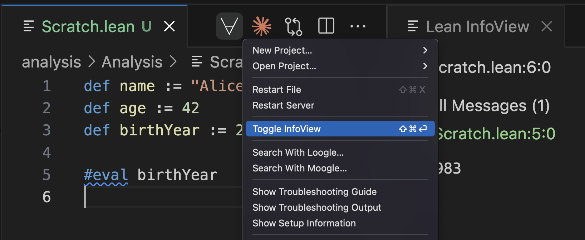
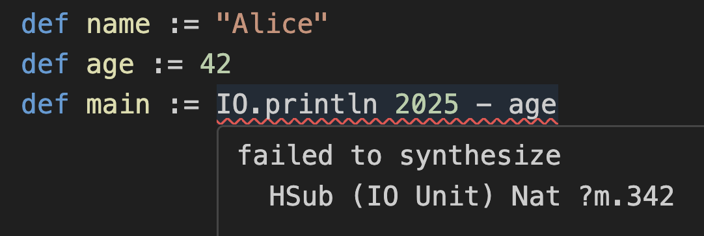
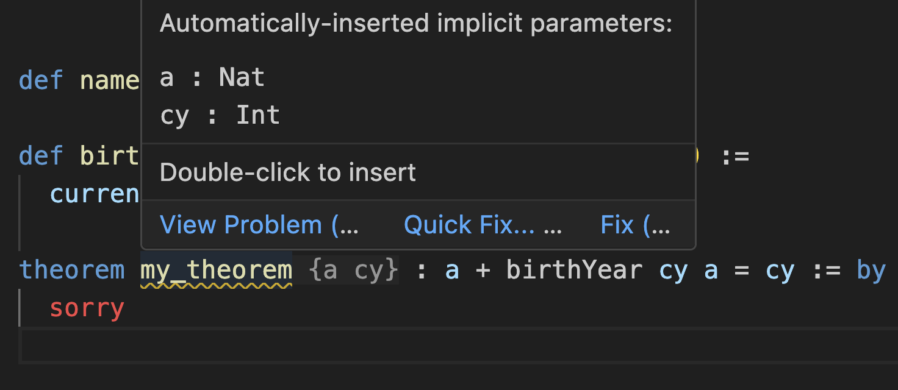
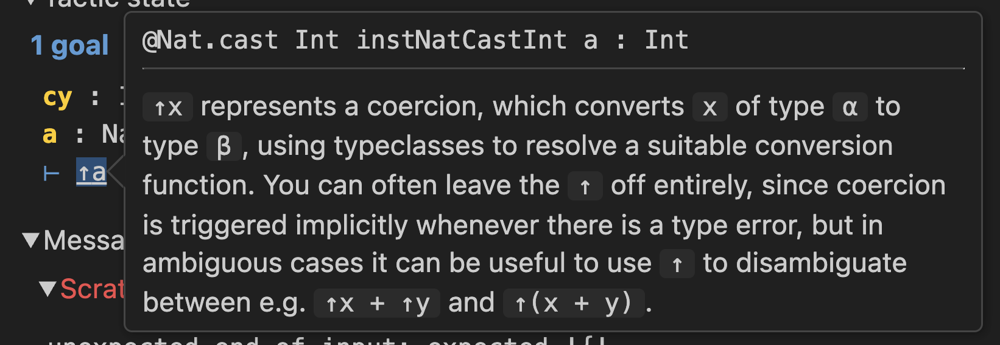
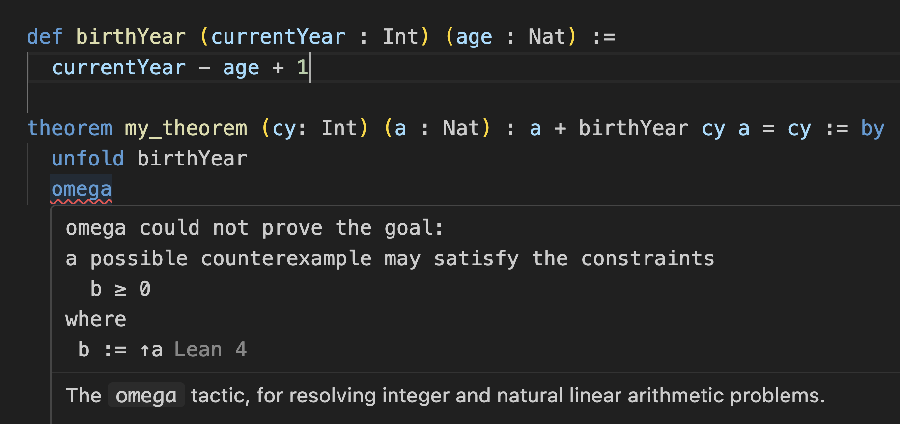
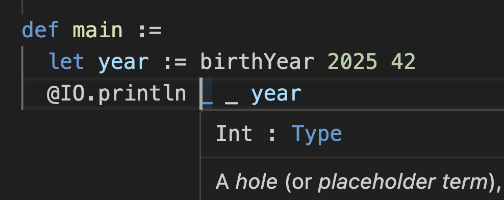

This is my opinionated syntax primer for the [Lean](https://lean-lang.org/) programming language. It is far from complete and may contain inaccuracies (I'm still learning Lean myself) but this is how I wish I was introduced to it, and what I wish was clarified.

---

### Why Lean?

This post assumes you're already eager to learn a bit of Lean. For motivation, I humbly submit to you two takes: [one from me](https://bsky.app/profile/danabra.mov/post/3lxjfxdlow22m) and [one from its creator](https://www.amazon.science/blog/how-the-lean-language-brings-math-to-coding-and-coding-to-math).

---

### Declaring Definitions

Let's start by writing a few *definitions*. These can appear at the top level of the file:

```lean
def name := "Alice"
def age := 42
```

*([Try it in the online playground.](https://live.lean-lang.org/#codez=CYUwZgBAdghgtiCAuAvBARAQQDYEsDGI6AUKJDAOaKoQAsATMUA))*

Note you have to write `:=` (assignment) rather than `=`. This is because Lean uses `=` for comparisons. This might remind you of Go or Pascal (if you're old enough).

Although you haven't written any types explicitly, each definition is typed. To find out their types, you can hover over `name` and `age` in the online playground or [inside VS Code](https://lean-lang.org/install/). You should see `name : String` and `42 : Nat`, respectively. (Going forward, when I say "hover", I'll assume either of those environments.)

Here, `String` is obviously a string, while `Nat` stands for a "natural number". In Lean, natural numbers include `0`, `1`, `2`, and so on, going up arbitrarily large.

You could specify types explicitly by writing ` : SomeType` before the `:=`:

```lean
def name : String := "Alice"
def age : Nat := 42
```

If you don't, Lean will try to infer the type from what you wrote on the right side.

---

### Specifying Types

You've just seen that Lean infers `"Alice"` to be a `String` and `42` to be a `Nat`. A `Nat` could be `0`, `1`, `2`, and so on. What if you try a negative number like `-140`?

```lean
def temperature := -140
```

If you hover on `temperature`, you'll see that it's an `Int`. An `Int`, which stands *for integer*, is a built-in type allowing any whole number, negative or positive.

You could ask for a specific type like `Int` explicitly in the definition:

```lean
def roomTemperature : Int := 25
```

If you just wrote `def roomTemperature := 25`, Lean would give you a `Nat`, but adding `: Int` explicitly nudged type inference to try to produce an `Int`.

Another way to ask for a specific type is to wrap the expression itself:

```lean
def roomTemperature := (25 : Int)
```

In both cases, you're saying you really want to get an `Int`. If Lean couldn't figure out how to produce an `Int` from the expression, it would give you a type error.

---

Let's calculate Alice's birth year based on her age:

```lean {3}
def name := "Alice"
def age := 42
def birthYear := 2025 - age
```

We need to get `birthYear` somewhere on the screen. If you're following along in the [online playground](https://live.lean-lang.org/), you might realize that your code isn't actually running.

This is because there are two ways to use Lean.

One way to use Lean is to run your code. Another way to use Lean is to prove some facts *about* your code. You can also do both--write code and proofs about it. We're going to start by learning to run some code, and then we'll look at writing proofs.

---

### Running Code

If you just want to see the result of some expression, add an `#eval` command:

```lean {5}
def name := "Alice"
def age := 42
def birthYear := 2025 - age

#eval birthYear
```

Hovering over this `#eval` in your editor will now say `1983`. Another place where it'll show up is the *InfoView* on the right side of the online playground:


Note `1983` in the bottom right corner. If you [set up VS Code with the Lean extension](https://lean-lang.org/install/) locally, you can get the same InfoView displayed like this:



Lean InfoView is incredibly useful and I suggest to keep it open at all times.

The `#eval` command is handy for doing inline calculations and to verify your code is working as intended. But maybe you actually want to run a program that outputs something. You can turn a Lean file into a real program by defining `main`:

```lean {4}
def name := "Alice"
def age := 42
def birthYear := 2025 - age
def main := IO.println birthYear
```

I intentionally did not say "a `main` function" because `main` is not a function. (You can hover over it to learn the type of the `main` but we won't focus on that today.)

Let's run our program:

```sh
lean --run Scratch.lean
```

Now `1983` appears in the terminal. Alternatively, you could also do this:

```sh
lean Scratch.lean -c Scratch.c
```

The C code generated by Lean compiler will include an instruction to print `1983`:

```c
LEAN_EXPORT lean_object* _lean_main(lean_object* x_1) {
  lean_object* x_2; lean_object* x_3;
  x_2 = lean_unsigned_to_nat(1983u);
  x_3 = l_IO_println___at___main_spec__0(x_2, x_1);
  return x_3;
}
```

Now you see that Lean can be used to write programs.

---

### Writing Proofs

Now let's *prove* that `age + birthYear` together add up to `2025`.

Define a little `theorem` alongside with your program:

```lean {5-6}
def name := "Alice"
def age := 42
def birthYear := 2025 - age

theorem my_theorem : age + birthYear = 2025 := by
  sorry
```

A `theorem` is [like](https://proofassistants.stackexchange.com/a/1576) a `def`, but aimed specifically at declaring proofs.

The declared type of a theorem is a statement that it's supposed to prove. Your job is now to construct a proof of that type, and the Lean "tactic mode" (activated with `by`) provides you with an interactive and concise way to construct such proofs.

Initially, the InfoView tells you that your goal is `age + birthYear = 2025`:


However, that's not something you can be sure in directly. What's `age`? Try to `unfold age` to replace `age` in the goal with whatever its definition says:


Note how this made the goal in your InfoView change to `42 + birthYear = 2025`. Okay, but what's a `birthYear`? Let's `unfold birthYear` as well:


You're getting closer; the goal is now `42 + (2025 - age) = 2025`. Unfolding `birthYear` brought back `age`, what's `age` again? Let's `unfold age`:


At this point the goal is `42 + (2025 - 42) = 2025`, which is a simple arithmetic expression. The built-in `decide` tactic can solve those with gusto:


And you're done! You've now proven that `age + birthYear = 2025` without actually having *run* any code. This is being verified *during typechecking.*

You can verify that editing `age` to another number will not invalidate your proof. However, if you edit `birthYear` to `2023 - age`, the proof no longer typechecks:


Of course, this was all a bit verbose. Instead of doing `unfold` for each definition manually, you can tell the `simp` simplifier to do them recursively for you:

![simp [age, birthView] solves the same theorem](./13.png)

This also proves the goal.

This example is contrived but I wanted to show you how it feels to step through the code step by step and transform it "outside in". It almost makes you feel like *you're* the computer, logically transforming the code towards the goal. It won't always be so tedious, especially if you have some useful theorems prepared.

We'll come back to proving things, but for now let's learn some more Lean basics.

---

### Opening Namespaces

Have another look at this `main` definition:

```lean {4}
def name := "Alice"
def age := 42
def birthYear := 2025 - age
def main := IO.println birthYear
```

Here, `IO.println birthYear` is a function call. `IO` is a namespace, and `println` is a function defined in that namespace. You pass `birthYear` to it.

You could avoid the need to write `IO.` before it by *opening* the `IO` namespace:

```lean {1,6}
open IO

def name := "Alice"
def age := 42
def birthYear := 2025 - age
def main := println birthYear
```

This doesn't have to be done at the top of the file:

```lean {5}
def name := "Alice"
def age := 42
def birthYear := 2025 - age

open IO
def main := println birthYear
```

It can be a bit confusing that now you have to write `IO.println` anywhere above that `open IO` but you can write `println` directly anywhere below it. As an alternative, you can scope opening `IO` to a specific definition by adding `in`:

```lean {5}
def name := "Alice"
def age := 42
def birthYear := 2025 - age

open IO in
def main := println birthYear
```

This would make the shorter syntax available inside `main` but not outside it.

We're not using `IO` much so I'll keep referring to `println` as `IO.println` below.

---

### Passing Arguments

Now notice how you're passing `birthYear` to the `println` function:

```lean {4}
def name := "Alice"
def age := 42
def birthYear := 2025 - age
def main := IO.println birthYear
```

Unlike languages like JavaScript, Lean doesn't use parentheses or commas for function calls. Instead of `f(a, b, c)`, you would write `f a b c` in Lean.

I need to emphasize this. No commas and no parens are used for function calls!

However, you would sometimes use parentheses *around* individual arguments. Suppose you replace `birthYear` with `2025 - age` directly in the function call:

```lean {3}
def name := "Alice"
def age := 42
def main := IO.println 2025 - age
```

This will lead to an error:



Lean thinks you're trying to do `(IO.println 2025) - age`, so it looks for a way to subtract `age` (which is a `Nat`) from whatever `IO.println 2025` returns (which happens to be something called `IO Unit`). Lean can't find a subtraction operation (`HSub`) between an `IO Unit` and a `Nat`, so it gives up in frustration.

To fix this, add parentheses around `2025 - age`:

```lean {3}
def name := "Alice"
def age := 42
def main := IO.println (2025 - age)
```

Now instead of `IO.println` "eating" the `2025` argument, it knows that the first argument is the entire `(2025 - age)` expression. You might find it helpful to use `(` and `)` liberally and try removing them to get a feel for when they're necessary.

Note `(` and `)` here have nothing to do with the `IO.println` function call. Their only purpose is to "group" `2025 - age` together, like you group things in math.

**In other words, instead of writing `something(f(x, y), a, g(z))` as you might in JavaSript, you would write `something (f x y) a (g z)` in Lean.**

Read this closely several times and make sure it burns deep in your subconscious.

---

### Nesting Expressions

You can't nest Lean definitions. However, if some of your definitions get complex, you can simplify them by declaring some `let` bindings inside of the `def`.

For example, you could pull `(2025 - age)` from the last example into a `let`:

```lean {5-6}
def name := "Alice"
def age := 42

def main :=
  let birthYear := 2025 - age
  IO.println birthYear
```

Again, note the use of `:=` for assignment. It's `:=`, not `=`!

You might think that being multiline makes `main` a function, but it doesn't. Adding a `let` binding is just a way to make definitions easier to read. You could use `let` inside of any definition, including the `name` and `age` definitions:

```lean {2-3,6-8}
def name :=
  let namesInPassport := ["Alice", "Babbage", "McDuck"]
  namesInPassport[0]

def age :=
  let twenty := 20
  let one := 1
  twenty + twenty + one + one

def main :=
  let birthYear := 2025 - age
  IO.println birthYear
```

There is no need for a `return` statement here. The last line of a definition becomes its value. This is why the definitions above are equivalent to:

```lean
def name := ["Alice", "Babbage", "McDuck"][0]
def age := 20 + 20 + 1 + 1
def main := IO.println (2025 - age)
```

In the end, the right side of any definition unfolds into a single expression, but `let` lets you break down that expression into more readable (and reusable) pieces.

---

### Declaring Functions

Currently `birthYear` hardcodes `2025` into the calculation:

```lean {3}
def name := "Alice"
def age := 42
def birthYear := 2025 - age
def main := IO.println birthYear
```

You can turn `birthYear` into a *function* definition by declaring a `currentYear` argument immediately after writing `def birthYear` followed by a space:

```lean {3}
def name := "Alice"
def age := 42
def birthYear currentYear := currentYear - age
```

This makes `birthYear` a function. You can call it by writing `birthYear 2025`:

```lean {4}
def name := "Alice"
def age := 42
def birthYear currentYear := currentYear - age
def main := IO.println (birthYear 2025)
```

Again, the parens around `birthYear 2025` ensure that `IO.println` doesn't try to "eat" the `birthYear` function itself. We want it to "eat" `birthYear 2025`.

If you hover over `birthYear` now, you'll see that its type is no longer a `Nat`:


This is how Lean pretty-prints function types. You see the function name `birthYear`, followed by its arguments (we only have one), `:` and the return type.

You could write it that way explicitly, too, to clarify your intended types:

```lean
def birthYear (currentYear : Nat) : Nat := currentYear - age
```

Note, again, that `(` `)` parentheses in Lean have nothing to do with function calls. You only use the parentheses to treat `(currentYear : Nat)` as a single thing.

---

### Many Ways to Declare a Function

You've seen two ways to define the same function, with implicit and explicit types:

```lean
/-- Types are implicit here, Lean infers them -/
def birthYear currentYear := currentYear - age

/-- Types are explicit here -/
def birthYear (currentYear : Nat) : Nat := currentYear - age
```

There are even more valid ways to write the same thing with different verbosity. Here is a (non-exhaustive) list of ways to define the same `birthYear` function:

```lean
/-- Concise definition -/
def birthYear currentYear := currentYear - age
def birthYear (currentYear: Nat) := currentYear - age
def birthYear (currentYear: Nat) : Nat := currentYear - age

/-- Definition set to an anonymous function -/
def birthYear := fun currentYear => currentYear - age
def birthYear := fun (currentYear: Nat) => currentYear - age

/-- Definition (with explicit type) set to an anonymous function -/
def birthYear : Nat → Nat := fun currentYear => currentYear - age
```

This might remind you of `function f() {}` vs `const f = () => ...` in JS. I find the concise syntax most pleasant to read and recommend using it unless you specifically need an anonymous function (e.g. to pass it to another function).

Here, `Nat → Nat` is the actual type of `birthYear`, no matter which syntax is used. It takes a `Nat` and it returns a `Nat`, so it's `Nat → Nat`. The fancy `→` arrow is typed by writing `\to` followed by a space in the [playground](https://live.lean-lang.org/) or with [Lean VSCode](https://lean-lang.org/install/).

Specifying argument types but inferring the return is often a nice middle ground:

```lean
def birthYear (currentYear: Nat) := currentYear - age
```

Just like with `function` declarations vs arrow functions in JavaScript, the level of verbosity and typing that you want to do in each case is mostly up to you.

(Sidenote: You might also see syntax like `fun x ↦ x * 2` rather than `fun x => x * 2`. Here, `↦` is typed as `\maps`, and mathematicians prefer it aesthetically to `=>`. Lean doesn't distinguish them so you'll see `=>` in codebases like Lean itself while `↦` shows up in "mathy" codebases like Mathlib. They both work with `fun`.)

---

### Adding Arguments

Now that you know a dozen ways to write functions, let's get back to this one:

```lean {3}
def name := "Alice"
def age := 42
def birthYear currentYear := currentYear - age
def main := IO.println (birthYear 2025)
```

Suppose you want to make `age` an argument to the `birthYear` function. To add an argument, just write it next in the `def birthYear` definition argument list:

```lean {2-3}
def name := "Alice"
def birthYear currentYear age := currentYear - age
def main := IO.println (birthYear 2025 42)
```

Actually, this doesn't work, and the error is sucky.


The problem is the issue I described earlier--at this point, Lean has no idea what the types of `currentYear` and `age` might be. Previously, it relied on `age` being an earlier declaration (and inferred it to be a `Nat`) but now Lean is truly stumped.

The strange error message ("typeclass instance is stuck") alludes to the fact that it's trying to find an implementation of subtraction between two types (searching for that implementation is done via "typeclass search") but it doesn't even know what those types are (that's why you see weird `?m.24` and `?m.12` placeholders).

The fix to this is to bite the bullet and to actually specify the types:

```lean {3}
def name := "Alice"

def birthYear (currentYear : Nat) (age : Nat) :=
  currentYear - age

def main := IO.println (birthYear 2025 42)
```

Now there is no ambiguity. Note that the parentheses here don't mean anything special--it's only a way to separate parameters from each other. Just like when calling functions, we're not using commas so we need parens for grouping.

When you have multiple parameters of the same type in a row, like `currentYear` and `age` above, you may put them together together under one type declaration:

```lean {3}
def name := "Alice"

def birthYear (currentYear age : Nat) :=
  currentYear - age

def main := IO.println (birthYear 2025 42)
```

This doesn't change semantics but is shorter to write. This is particularly useful in mathematics where you might have 3 or 4 parameters that are all `Nat` or such.

Now that you're specifying all parameter types explicitly, it makes sense to think about them harder and to give them slightly different types. While `age` should remain a `Nat`, `currentYear` makes more sense as an `Int` so that the calculation still works for people born in the BC era or who are over two thousand years old.

```lean {3}
def name := "Alice"

def birthYear (currentYear : Int) (age : Nat) :=
  currentYear - age

def main := IO.println (birthYear 2025 42)
```

The non-pretty-formatted type of `birthYear` is `Int → Nat → Int` because it takes an `Int` and also a `Nat`, and returns an `Int`. As in some other functional languages, you can partially apply it--for example, `birthYear 2025` will give you a `Nat → Int` function that you can later call with the remaining `age` argument.

By now, you might have guessed that there are other increasingly deranged equivalent ways to define the same function that takes an `Int` and a `Nat`:

```lean
def birthYear (currentYear : Int) (age : Nat) := currentYear - age
def birthYear (currentYear : Int) := fun (age : Nat) => currentYear - age
def birthYear := fun (currentYear : Int) (age : Nat) => currentYear - age
def birthYear := fun (currentYear : Int) => fun (age : Nat) => currentYear - age
def birthYear: Int → Nat → Int := fun currentYear age => currentYear - age
def birthYear: Int → Nat → Int := fun currentYear => fun age => currentYear - age
```

**Read them closely keeping in mind that they are all exactly equivalent in Lean.** It's confusing to mix syntax within a single definition so we'll stick with this:

```lean
def birthYear (currentYear : Int) (age : Nat) :=
  currentYear - age
```

It's time to revisit proofs.

---

### Proving For All

A few sections earlier, you've proven `birthYear + age = 2005` for this code:

```lean
def name := "Alice"
def age := 42
def birthYear := 2025 - age

theorem my_theorem : age + birthYear = 2025 := by
  simp [age, birthYear]
```

However, now `birthYear` is a function which takes two arguments:

```lean {3}
def name := "Alice"

def birthYear (currentYear : Int) (age : Nat) :=
  currentYear - age
```

You could copypaste this theorem for concrete values of `age` and `currentYear`:

```lean {6-13}
def name := "Alice"

def birthYear (currentYear : Int) (age : Nat) :=
  currentYear - age

theorem my_theorem : 42 + birthYear 2025 42 = 2025 := by
  simp [birthYear]

theorem my_theorem' : 25 + birthYear 2025 25 = 2025 := by
  simp [birthYear]

theorem my_theorem'' : 77 + birthYear 1980 77 = 1980 := by
  simp [birthYear]
```

These proofs typecheck, but there's a feeling that it's not any better than writing tests. What we're hoping to capture is a *universal pattern*, not a bunch of cases.

The fact is, no matter what `cy` (I'll shorten "current year" to that) and `a` (short for "age") are, `a + birthYear cy a` should be equal to `cy`. Let's capture that:

```lean {6-7}
def name := "Alice"

def birthYear (currentYear : Int) (age : Nat) :=
  currentYear - age

theorem my_theorem : a + birthYear cy a = cy := by
  sorry
```

Although you haven't declared `a` and `cy`, this is actually valid syntax! The VS Code Lean extension will implicitly insert `{a cy}` arguments after `my_theorem`:



These "implicit" arguments surrounded by `{` `}` curly braces can sometimes be very useful to avoid boilerplate, but in this case they're more confusing than helpful. Let's declare `cy` and `a` explicitly as normal arguments to `my_theorem`:

```lean {6}
def name := "Alice"

def birthYear (currentYear : Int) (age : Nat) :=
  currentYear - age

theorem my_theorem (cy : Int) (a : Nat) : a + birthYear cy a = cy := by
  sorry
```

Note how declaring `my_theorem` with `cy` and `a` is similar to declaring function arguments--except that you can't actually "run" this theorem. You're just stating that, for any `cy` and `a`, you can produce a proof of `a + birthYear cy a = cy`.

Let's see if you actually can!

You start out with the goal of `↑a + birthYear cy a = cy`:


The `⊢` symbol before it tells you that this is the goal, i.e. what you want to prove. Things above it, like `cy : Int` and `a : Nat`, are the things you *already have.*

You might be wondering: what *are* those `cy : Int` and `a : Nat`. What *are* their values? But the question doesn't make sense. You're writing a proof, so in a sense, you are working with *all possible values at the same time.* You only have their types.

Have another look at the goal: `↑a + birthYear cy a = cy`.

What's that up arrow?

Hover over it in the InfoView:



The signature is a bit confusing (what's that `@`? what's that `instNatCastInt`?) but you can see that it takes your `a` (which is a `Nat`) and returns an `Int`. So this is how Lean displays the fact that your `a` is being converted to an `Int` so that it can be added with the result of `birthYear cy a` call (which is already an `Int`).

Okay, cool, the goal is to prove `↑a + birthYear cy a = cy`. How do we do that?

Well, first, let's `unfold birthYear` to replace it with the implementation:


Now the goal becomes `↑a + (cy - ↑a) = cy`.

You can't use the `decide` tactic from earlier because it only deals with known concrete numbers--it's like a calculator. However, Lean also includes an `omega` tactic that can check equations that include unknown numbers like `a` and `cy`.

With `omega`, you can complete this proof!


Let's have another look at the full code:

```lean
def name := "Alice"

def birthYear (currentYear : Int) (age : Nat) :=
  currentYear - age

theorem my_theorem (cy: Int) (a : Nat) : a + birthYear cy a = cy := by
  unfold birthYear
  omega
```

You have a function called `birthYear` and a theorem called `my_theorem` about its behavior. By convention, you might want to call it `birthYear_spec`, or something more specific like `age_add_birthYear_eq_current_year`.

In a way it's like a test, but it's a test for *all possible inputs of that function* that runs during typechecking. I think this is incredibly cool. You can verify that incorrectly changing the formula of `birthYear` will cause the proof to no longer typecheck:



---

### Universal Quantifier

You've previously declared `cy` and `a` as arguments for `my_theorem`:

```lean
theorem my_theorem (cy: Int) (a : Nat) : a + birthYear cy a = cy := by
  unfold birthYear
  omega
```

In this case, it's fine to omit their types because they can be exactly inferred by Lean from the `birthYear` call itself, which you already explicitly annotated:

```lean {1}
theorem my_theorem cy a : a + birthYear cy a = cy := by
  unfold birthYear
  omega
```

This theorem says "for all `cy` and `a`, `a + birthYear cy a` is equal to `cy`”. Mathematicians have their own way of writing statements like this, using the *universal quantifier* ∀ (which stands for "for all"): *∀ cy a, a + birthYear(cy, a) = cy*.

You can restate the above in a mathematician's style with the `∀` quantifier:

```lean {1}
theorem my_theorem : ∀ cy a, a + birthYear cy a = cy := by
  sorry
```

To type `∀`, write `\all` and press space.

Now instead of `cy a :`, we have `: ∀ cy a`. The universal quantifier lets the arguments get introduced "later"--pretty much like currying in programming. However, the difference is mostly stylistic. The theorem signature is the same.

When you use `∀`, you're starting out with a universal statement ("for all `cy` and `a`") so `cy` and `a` aren't in your tactic state yet. Use `intro cy a` to bring them in:


Again, you don't have their *concrete* values because a proof is supposed to work for all possible values. You don't know anything about them except their types.

From that point, your goal is `↑a + birthYear cy a = cy`, which you can solve:

```lean {3-4}
theorem my_theorem : ∀ cy a, a + birthYear cy a = cy := by
  intro cy a
  unfold birthYear
  omega
```

Notice how `∀ cy a` has essentially moved the declarations of `cy` and `a` "inside" the proof itself. Under the hood, the `intro` tactic generates a nested function with `cy` and `a` arguments, so in the end this `theorem` has the same shape as before adding `∀`. It may feel disorienting that Lean lets you write the same thing in many styles, but this lets the Lean core stay small and evolve faster, while tactics and conventions may evolve independently and vary between projects.

Using `∀` may not seem particularly appealing in this example, but it is great for nested propositions where anonymous functions would add too much clutter. It can also be convenient to extract a theorem's claim into its own definition:

```lean {1,3,4}
def TheLawOfAging : Prop := ∀ cy a, a + birthYear cy a = cy

theorem my_theorem : TheLawOfAging := by
  unfold TheLawOfAging
  intro cy a
  unfold birthYear
  omega
```

To learn what a `Prop` is, check out [my previous article](/beyond-booleans/).

---

### Implicit Arguments

Now let us come back to this example, and specifically to this line:

```lean {8}
def name := "Alice"

def birthYear (currentYear : Int) (age : Nat) :=
  currentYear - age

def main :=
  let year := birthYear 2025 42
  IO.println year
```

Hover over `IO.println`, and you might freak out:

![IO.println.\{u_1\} \{a : Type u_1\} [ToString α] (s: α) : IO Unit](./25.png)

What the hell is this signature?! Learning to read these signatures will immensely improve your ability to understand Lean APIs and debug errors so I'm going to break it down even though we haven't discussed most of the relevant topics.

The key insight is that the parts in `{` `}` and `[` `]` are not something you pass to the function directly. That's why you're able to just write `IO.println year`. However, these *are* actual arguments--they're just filled in by Lean itself.

Command+Click into `println` to see that it declares `{α}` and `[ToString α]`:

```lean
def println {α} [ToString α] (s : α) : IO Unit :=
  print ((toString s).push '\n')
```

So if you Lean fills them in for you, where *are* they coming from?

The parts in `{` `}` are called *ordinary implicit parameters*, and they are filled in by type inference based on the parameters that have already been passed in. If Lean can't unambiguously fill them in, it will complain and would not typecheck. Here, the `α` argument is implicit, but it's determined by what *you* passed as an explicit `(s : α)` argument. You're printing an `Int`, you passed `(s: Int)`, so `α` is `Int`. This is similar to generics, but in Lean generics are just arguments (often implicit).


The parts in `[` `]`, like `[ToString α]`, are called *instance implicit parameters* and are filled in automatically depending on the code you've imported so far. Lean has a mechanism that lets libraries declare implementations of certain intefaces--for example, "how to subtract `Int` and `Int`" or "how to convert `Nat` to `Int`" or "how to turn an `Int` to a `String`”. The `println` function wants a `ToString` implementation that knows how to turn whatever *you* passed (an `Int`) to a string. Lean has a `ToString Int` implementation in core, so that's what `println` gets.

Finally, the very first `.{}` thing is a "universe" in which this function's type lives. This is rarely something you need to deal with, and is also filled in automatically.

If you're curious what Lean is filling in (or need to debug some gnarly case that wouldn't typecheck), you can prefix your function call with `@` to force all arguments to be passed explicitly. Start by passing `_` placeholders:

```lean {8}
def name := "Alice"

def birthYear (currentYear : Int) (age : Nat) :=
  currentYear - age

def main :=
  let year := birthYear 2025 42
  @IO.println _ _ year
```

Now you can hover over each `_` placeholder to see what Lean has inferred for it.

For example, the `{α}` implicit parameter was inferred to be `Int`:



And the `[ToString]` instance implicit parameter received `instToStringInt`:


If you want to further debug what's going on, you can fill them in in the code:

```lean {8}
def name := "Alice"

def birthYear (currentYear : Int) (age : Nat) :=
  currentYear - age

def main :=
  let year := birthYear 2025 42
  @IO.println Int instToStringInt year
```

That's what you would have to type if Lean couldn't fill them in automatically.

Now it's easy to Command+Click them and see if they match what you expected. For example, Command+Clicking `instToStringInt` from here will teleport you to the place in the Lean source that actually implements `ToString Int`:

```lean
instance : ToString Int where
  toString
    | Int.ofNat m   => toString m
    | Int.negSucc m => "-" ++ toString (succ m)
```

Seems legit! When you're done spelunking, you can remove the `@` and the `_`s:

```lean {8}
def name := "Alice"

def birthYear (currentYear : Int) (age : Nat) :=
  currentYear - age

def main :=
  let year := birthYear 2025 42
  IO.println year
```

Implicit and instance arguments save a tremenduous amount of boilerplate when operating on complex structures like mathematical objects and proofs. But even here, they let Lean provide a simple, extensible, and strongly-typed `println` API.

---

### Command+Click Anything

There's a *lot* more I would've liked to cover but I'm running out of steam--and this article is already long. The good news is, there's a lot you can learn by peeking under the hood on your own because Lean is extremely Command+Click-able.

You can Command+Click into data types like [`Nat`](https://github.com/leanprover/lean4/blob/ad1a017949674a947f0d6794cbf7130d642c6530/src/Init/Prelude.lean#L1181-L1202) and [`String`](https://github.com/leanprover/lean4/blob/ad1a017949674a947f0d6794cbf7130d642c6530/src/Init/Prelude.lean#L2738-L2752), and even pieces of syntax like `∀`. Much of Lean is implemented in Lean itself, and most of the time what I found ended up both simpler and more interesting than what I expected.

```lean
/--
The natural numbers, starting at zero.
This type is special-cased by both the kernel and the compiler, and overridden with an efficient
implementation. Both use a fast arbitrary-precision arithmetic library (usually
[GMP](https://gmplib.org/)); at runtime, `Nat` values that are sufficiently small are unboxed.
-/
inductive Nat where
  /-- Zero, the smallest natural number. -/
  | zero : Nat
  /-- The successor of a natural number `n`. -/
  | succ (n : Nat) : Nat
```

Who would've thought that numbers are just a recursively generated enum?

Turns out, a language built with recursively defined types like this can express and prove facts like that the [area of a circle is π * r ^ 2](https://github.com/leanprover-community/mathlib4/blob/aac79004bad67a82c18ab7d39c609529f4159d6f/Archive/Wiedijk100Theorems/AreaOfACircle.lean#L81-L130), or that [it takes 23 people to exceed a 50% chance of same birthday](https://github.com/leanprover-community/mathlib4/blob/aac79004bad67a82c18ab7d39c609529f4159d6f/Archive/Wiedijk100Theorems/BirthdayProblem.lean#L65-L81), or that [you can't cube a cube](https://github.com/leanprover-community/mathlib4/blob/aac79004bad67a82c18ab7d39c609529f4159d6f/Archive/Wiedijk100Theorems/CubingACube.lean#L533-L546). But you can also write normal programs with it that compile to C. [Async/await](https://lean-lang.org/fro/roadmap/1900-1-1-the-lean-fro-year-3-roadmap/) is in the works.

Maybe you could create something in the middle--programs interleaved with proofs? You can see this pattern in the Lean core itself: here's a [`List.append` (`++`) function](https://github.com/leanprover/lean4/blob/c83237baf78d6930d40e556a5cacdca149c4b198/src/Init/Data/List/Basic.lean#L614-L616), and here are proofs that [`(as ++ bs).length = as.length + bs.length`](https://github.com/leanprover/lean4/blob/c83237baf78d6930d40e556a5cacdca149c4b198/src/Init/Data/List/Basic.lean#L661-L664) and [`(as ++ bs) ++ cs = as ++ (bs ++ cs)`](https://github.com/leanprover/lean4/blob/c83237baf78d6930d40e556a5cacdca149c4b198/src/Init/Data/List/Basic.lean#L666-L669) written alongside it. In other words, using the Lean data structures in code means also lets you reuse known facts about those structures to prove claims about your own code.

---

### Programming With Proofs

Lean is built on old ideas and a lot of prior art, but there are both novel and pragmatic twists. Sometimes I can't tell if I'm writing Go or Haskell, Rocq or C#, OCaml or Python. In its giddily unrestrained ambition it reminds me of [Nemerle](https://en.wikipedia.org/wiki/Nemerle), but it also feels solid and grounded. It's being used in both industry and academia, including by [DeepMind](https://deepmind.google/discover/blog/ai-solves-imo-problems-at-silver-medal-level/) and [Amazon](https://aws.amazon.com/blogs/opensource/lean-into-verified-software-development/). It's been a while since I felt excited about a programming language (mind you--a *pure* functional programming language).

Anyway, here's a little program that counts up and down alongside some proofs.

```lean
def append (xs ys : List a) : List a := Id.run do
  let mut out := ys
  for x in xs.reverse do
    out := x :: out
  return out

theorem append_abcd : append ["a", "b"] ["c", "d"] = ["a", "b", "c", "d"] := by
  simp [append]

theorem append_length (xs ys : List a) : (append xs ys).length = xs.length + ys.length := by
  simp [append]


def count_up_and_down n :=
  let up := List.range (n)
  let down := (List.range (n + 1)).reverse
  append up down

theorem count_up_and_down_length n : (count_up_and_down n).length = n * 2 + 1 := by
  simp only [count_up_and_down, append_length, List.length_range, List.length_reverse]
  omega


def main := do
  IO.println "Enter a number: "
  let stdin ← IO.getStdin
  let input ← stdin.getLine
  let n := input.trim.toNat!
  let sequence := count_up_and_down n
  IO.println sequence
```

I've never written code alongside proofs like this before. Have you?
